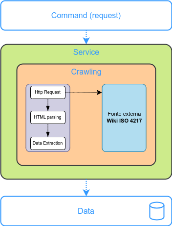
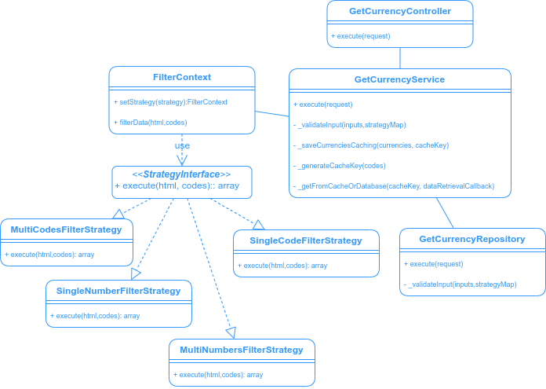
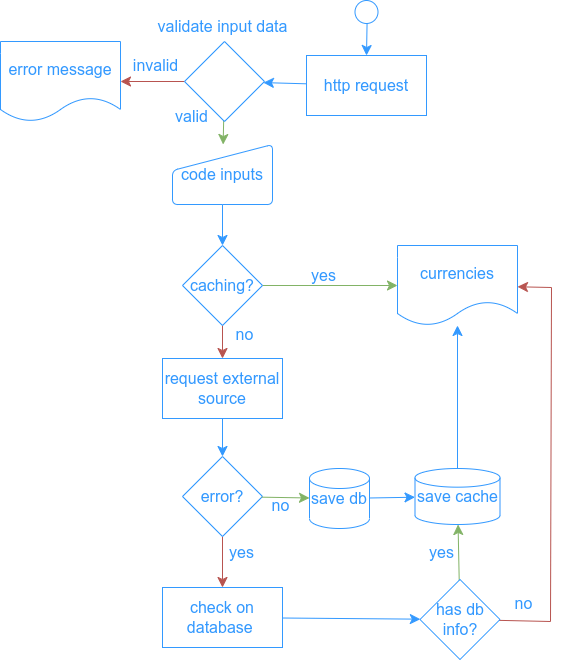

## Currency Crawling backend  api

[Client Web repository](https://github.com/GYOVANNE/currency-crawler-web)


## Run Project

```sh
docker-compose up -d
```
 - Run composer install
 - Generate key
 - Run migrations
 - Run tests

# Api request Example

```php
curl --location --request POST 'http://localhost:4002/api/currency' \
--header 'Content-Type: application/json' \
--data-raw '{
  "code":"BRL"
}'

```
- Result

```json
{
    "code": "BRL",
    "number": 986,
    "decimal": 2,
    "currency": "Real",
    "currency_locations": [
        {
            "location": "Brasil",
            "icon": "https://upload.wikimedia.org/wikipedia/commons/thumb/0/05/Flag_of_Brazil.svg/22px-Flag_of_Brazil.svg.png"
        }
    ]
}
```
# Documentation

### Components



 

### Classes



### Flow



